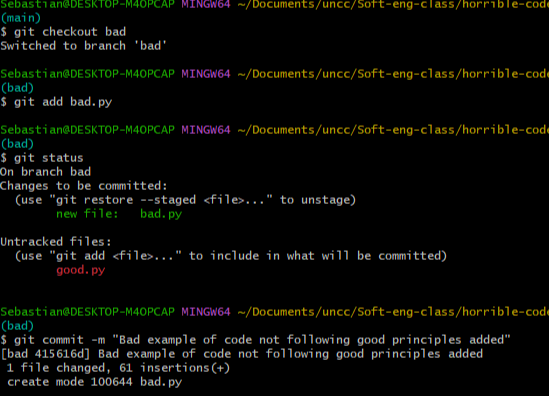
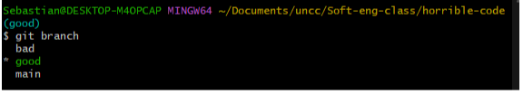
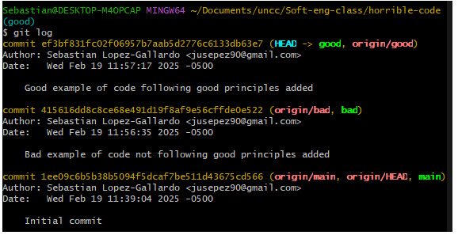

# __The Bad__
This code breaks KISS, Dry, YAGNI, Good documentation, Clean code

## KISS 
    The code adds an unnecessary amount of code to perform a simple task, adding extra lines in a code that could be simplified by a single return line.

## Dry
    Various functions are the same as others but with a slight variation, and instead of reapeating the function they perfom the same unnecessaryly long process all over again.

## YAGNI
    Unused function left on.

## Good documentation
    Poor comments with no real meaning

## Clean code
    Code is all over the place and it doesn't really have any organization

# __The Good__
This code properly follows KISS, Dry, YAGNI, Good documentation, Clean code

## KISS 
    The code does the job in the most effective way, no extra lines which do pretty much nothing.

## Dry
    Instead of multiple functions and maybe even more doing the same, one function taking an array with all the numbers they want to add/substract/multiply.

## YAGNI
    Unused function removed.

## Good documentation
    Better comments with real meaning

## Clean code
    Code is divided by sections

# Git Use

